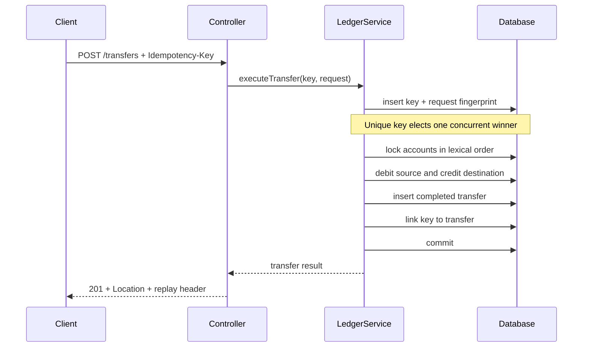

# Architecture

## Goal

The service is a compact reference for reliably transferring a fixed-scale
amount between two accounts in one relational database. The important boundary
is the database transaction, not the HTTP process.

## Components

| Component | Responsibility |
| --- | --- |
| `LedgerController` | HTTP contract, validation, status and replay headers |
| `TransferCoordinator` | Recovers the losing side of a concurrent key claim |
| `LedgerService` | Transaction boundary and transfer business rules |
| `AccountRepository` | Normal reads and explicit write-locked account reads |
| `IdempotencyKeyRepository` | Durable request claim and fingerprint |
| `TransferRepository` | Completed transfer audit records |

## Transfer sequence



## Atomicity

The idempotency claim, both balance updates, and the transfer record share one
`@Transactional` method. A thrown business or persistence exception rolls the
whole unit back. Failed business requests do not consume their key.

## Concurrency

Two separate mechanisms solve separate races:

1. The idempotency table primary key ensures only one transaction can claim a
   request key. A concurrent loser waits for the winner and then reads its
   result in a new transaction.
2. Pessimistic write locks serialize transfers touching the same account.
   Acquiring two locks in lexical account-number order reduces deadlock cycles.

The `@Version` column remains a defense-in-depth signal for accidental writes
that do not use the explicit locking query. The transfer path itself relies on
pessimistic locks.

## Idempotency semantics

The fingerprint is SHA-256 over canonical source account, destination account,
and normalized decimal amount. It is not an authentication primitive; it is a
compact equality check.

- Same key, same business fields: return the original transfer.
- Same key, different business fields: return `409 Conflict`.
- Failed, rolled-back attempt: the key is free to be retried.

Keys currently have no expiry. Production policy must define retention based on
the maximum client retry window and audit requirements.

## Data model

```text
accounts
  account_number (unique)
  balance decimal(19,2)
  version

transfers
  id (UUID string)
  from_account
  to_account
  amount decimal(19,2)
  status
  created_at

idempotency_keys
  request_key (primary key)
  request_fingerprint
  transfer_id
  created_at
```

Account numbers in transfer records are snapshots, which keeps the audit record
readable if richer account metadata is introduced later.

## Deliberate limitations

This is not yet a true double-entry ledger. Balances are mutable projections and
the completed transfer is the audit artifact. Production evolution should add
immutable journal entries where every transaction balances debits and credits,
then derive or reconcile account projections from those entries.

Other missing boundaries include currency, authentication, tenant isolation,
database migrations, reversals, settlement states, rate limits, and observability.
